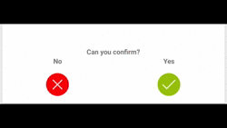

# HoldCircleButton
An android widget that presents a circular button designed to for actions which 
require caution. The idea is to visualize that the user must press the button at 
least a certain amount of time, by showing an indicator on how long he must hold it.




## How to integrate

Just copy [HoldCircleButton.java](blob/master/src/main/java/org/graetzer/ui/HoldCircleButton.java)
and [attrs.xml](blob/master/src/main/res/values/attrs.xml) to their respecitve directories in your project
(You might need to create ```java/org/graetzer/ui/``` and ```res/values```)
